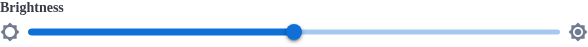

# BBBSlider

The `BBBSlider` component provides a horizontal, single-thumb slider for picking a value inside a
range. It supports labels (`label` and `helperText`), decorative end icons, marks with or without
tick dots, and a value tooltip.



## Usage Example

### Slider with a label

```jsx
import { BBBSlider } from 'bbb-ui-components-react';

<BBBSlider label="Brightness" defaultValue={50} />
```

### Volume, where the number matters

```jsx
import { BBBSlider } from 'bbb-ui-components-react';

<BBBSlider
  label="Volume"
  min={0}
  max={100}
  defaultValue={50}
  valueLabelDisplay="on"
  valueLabelFormat={(value) => `${value}%`}
  getAriaValueText={(value) => `${value} percent`}
  dataTest="volume-slider"
  onChange={(event, value) => setVolume(value)}
/>
```

### Brightness, where the number does not matter

```jsx
import { BBBSlider } from 'bbb-ui-components-react';
import { MdBrightnessLow, MdBrightnessHigh } from 'react-icons/md';

<BBBSlider
  label="Brightness"
  min={-100}
  max={100}
  defaultValue={0}
  iconStart={<MdBrightnessLow />}
  iconEnd={<MdBrightnessHigh />}
  valueLabelDisplay="off"
  onChange={(event, value) => setBrightness(value)}
/>
```

### Discrete stages with labels only

```jsx
import { BBBSlider } from 'bbb-ui-components-react';

<BBBSlider
  label="Webcam grid size"
  min={1}
  max={4}
  step={1}
  showMarkTicks={false}
  marks={[
    { value: 1, label: '1x1' },
    { value: 2, label: '2x2' },
    { value: 3, label: '3x3' },
    { value: 4, label: '4x4' },
  ]}
  defaultValue={2}
  onChangeCommitted={(event, value) => setGridSize(value)}
/>
```

## Accessibility

- Give every slider an accessible name: either `label` (which also renders visible text and is
  wired to the input with `htmlFor`) or `ariaLabel` when the design has no visible label.
- `helperText` is referenced by the input's `aria-describedby` automatically; `ariaDescribedBy`
  overrides it when the description lives elsewhere on the page.
- When `valueLabelFormat` shows something other than the raw value, pass the matching
  `getAriaValueText` so screen readers announce what the user sees.
- Keyboard support comes from MUI: arrows move by `step`, Page Up/Page Down jump, Home/End go to
  the ends.

## Testing

`dataTest` lands on the root element, and the focusable range input gets the same value suffixed
with `-input`. Drive the input, not the root:

```js
await page.locator('[data-test="volume-slider-input"]').fill('80');
```

## Notes

The value tooltip is rendered inside the slider, so a container with `overflow: hidden` can clip it
when the slider sits at the very top of the container. Use `valueLabelDisplay="off"` or reserve
vertical space above the slider in that case.

Mark labels are centred on their tick, so the labels at `min` and `max` extend half their width past
each end of the track. Reserve horizontal padding around the slider, or avoid labelling the extreme
marks, when the container clips.

`iconStart`/`iconEnd` render at `1.5rem` by default, matching a circle `BBButton`; pass a `size` on
the icon itself to override it.

## Props

| Property            | Type                                                              | Default  | Description                                                                                                                    |
| ------------------- | ------------------------------------------------------------------ | -------- | -------------------------------------------------------------------------------------------------------------------------------- |
| `label`             | `string`                                                            |          | The main label text displayed above the slider.                                                                                   |
| `helperText`        | `string`                                                            |          | The helper text displayed below the label.                                                                                        |
| `value`             | `number`                                                            |          | The current value; providing it makes the slider controlled.                                                                      |
| `defaultValue`      | `number`                                                            |          | The initial value used while the slider is uncontrolled.                                                                          |
| `min`               | `number`                                                            | `0`      | The minimum allowed value.                                                                                                         |
| `max`               | `number`                                                            | `100`    | The maximum allowed value.                                                                                                         |
| `step`              | `number \| null`                                                    | `1`      | The granularity the value moves by; `null` snaps to `marks`.                                                                      |
| `marks`             | `boolean \| { value: number, label?: ReactNode }[]`                 | `false`  | The marks rendered on the track.                                                                                                   |
| `showMarkTicks`     | `boolean`                                                           | `true`   | If `false`, renders the mark labels without their tick dots.                                                                      |
| `animate`           | `boolean`                                                           | `true`   | If `false`, disables transitions and hover/drag visual effects so state changes render instantly.                                 |
| `valueLabelDisplay` | `'auto' \| 'on' \| 'off'`                                           | `'auto'` | When the value tooltip is shown.                                                                                                   |
| `valueLabelFormat`  | `string \| ((value: number, index: number) => ReactNode)`           |          | Formats the value shown in the tooltip.                                                                                            |
| `getAriaValueText`  | `(value: number, index: number) => string`                          |          | The text screen readers announce for the current value.                                                                           |
| `iconStart`         | `React.ReactNode`                                                   |          | A decorative node rendered at the minimum end; it is hidden from screen readers.                                                  |
| `iconEnd`           | `React.ReactNode`                                                   |          | A decorative node rendered at the maximum end; it is hidden from screen readers.                                                  |
| `disabled`          | `boolean`                                                           | `false`  | If `true`, the slider is disabled and unresponsive.                                                                               |
| `onChange`          | `(event: Event, value: number) => void`                             |          | Fired continuously while the user drags or presses a key.                                                                         |
| `onChangeCommitted` | `(event: React.SyntheticEvent \| Event, value: number) => void`     |          | Fired once, when the interaction ends; prefer it for expensive updates.                                                           |
| `id`                | `string`                                                            |          | The HTML `id` of the underlying range input; auto-generated when omitted.                                                         |
| `dataTest`          | `string`                                                            |          | The `data-test` attribute for the root; the range input gets `${dataTest}-input`.                                                 |
| `ariaLabel`         | `string`                                                            |          | The accessible name for the slider.                                                                                               |
| `ariaLabelledBy`    | `string`                                                            |          | The ID of the element that labels the slider; ignored when `ariaLabel` is set, and falls back to the rendered label's id when omitted. |
| `ariaDescribedBy`   | `string`                                                            |          | The ID of the element that describes the slider; falls back to the rendered helper text's id when omitted.                        |
| `...props`          | `MuiSliderProps`                                                    |          | Any other props are passed down to the underlying Material-UI Slider component.                                                   |
